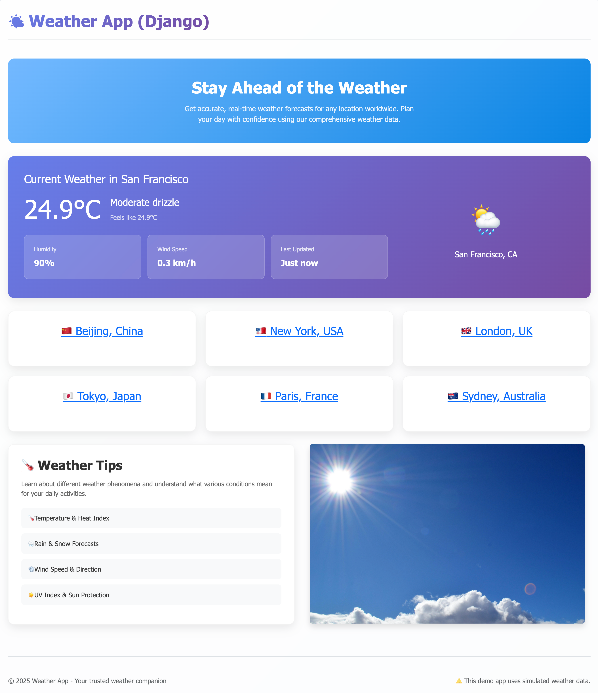

# aws-lambda-serverless-django-weather-app
Serverless Django app! Deploy Django web application to AWS Lambda by using Zappa.


## Setup local dev environment

This project uses `uv` to manage Python packages.

* Run `uv init .` to init the project.
* Run `uv venv .venv` to create a Python virtual environment.
* Run `uv add django` to add Django into pyproject's dependencies.
* Run `uv sync` to install packages in virtual environment.


## Develop a demo weather app

> ⚠️ **Warning:** *Assume you are familiar to Django development,* 
> *the development process is ignored.*

Create a weather app with simulated data, please look into the source code.

Activate the Python virtual environment and run Django dev server,
```bash
$ source .venv/bin/activate

$ python manage runserver
```

Then, visit the website on your local machine - [http://127.0.0.1:8000](http://127.0.0.1:8000)


