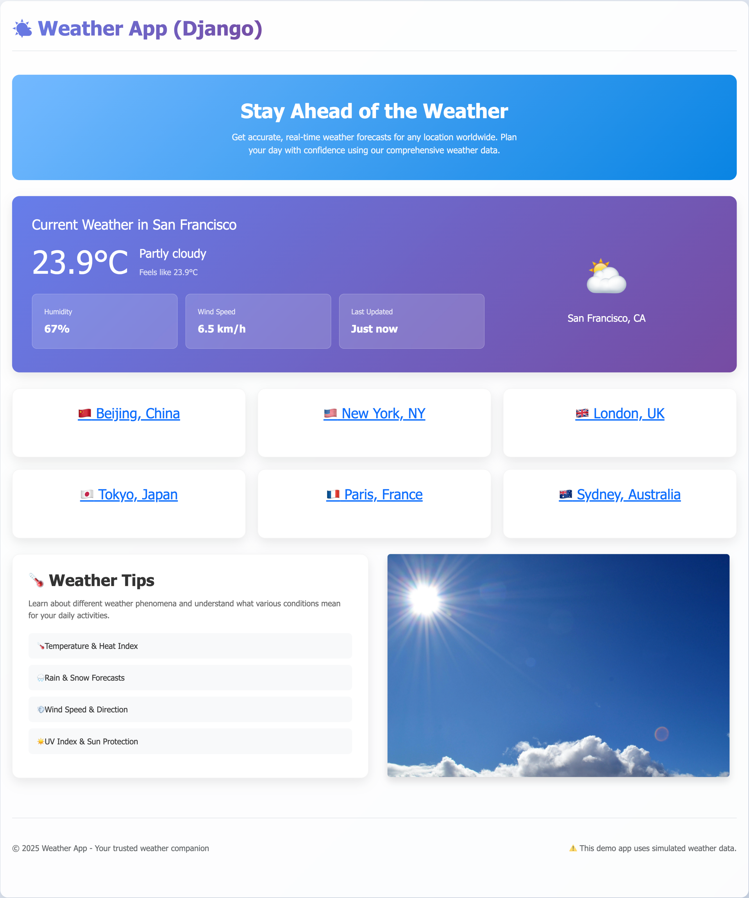

# aws-lambda-serverless-django-weather-app
Serverless Django app! Deploy Django web application to AWS Lambda by using Zappa.

## Setup local dev environment

This project uses `uv` to manage Python packages.

* Run `uv init .` to init the project.
* Run `uv venv .venv` to create a Python virtual environment.
* Run `uv add django` to add Django into pyproject's dependencies.
* Run `uv sync` to install packages in virtual environment.
* Run `source .venv/bin/activate` to active the environment.

## Develop a demo weather app

Create a weather app with simulated weather data, please see the source code.

Then activate the Python virtual environment and visit [http://127.0.0.1:8000](http://127.0.0.1:8000)

