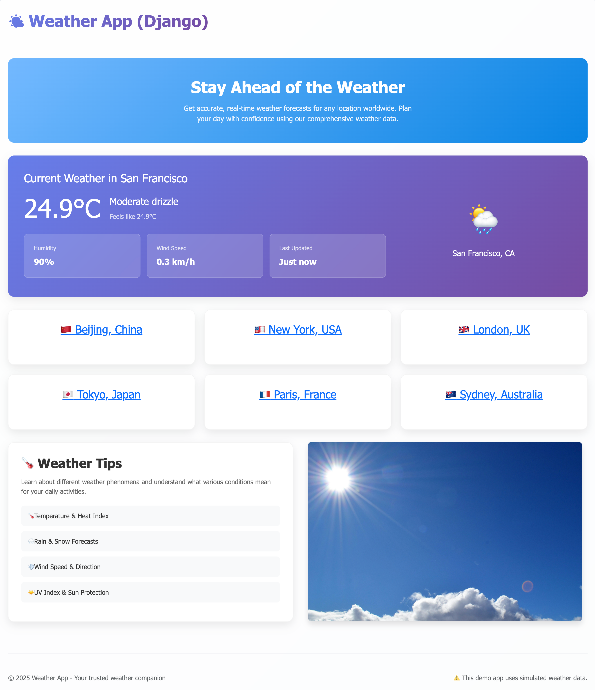

# aws-lambda-serverless-zappa-django-weather-app
Serverless Django app! Deploy Django web application to AWS Lambda by using Zappa.


## Setup local dev environment

This project uses `uv` to manage Python packages.

* Run `uv init .` to init the project.
* Run `uv venv .venv` to create a Python virtual environment.
* Run `uv add django` to add Django into pyproject's dependencies.
* Run `uv sync` to install packages in virtual environment.


## Develop a demo weather app

> ⚠️ **Warning:** *Assuming you are familiar with Django development,* 
> *the application development process is ignored here.*
> *Besides, this app is using postgres database. You'll need to setup at your side as well.*

Create a weather app with simulated data, please look into the source code.

Activate the Python virtual environment and run Django dev server,
```bash
$ source .venv/bin/activate

$ python manage mirate

$ python manage runserver
```

Then, visit the website on your local machine - [http://127.0.0.1:8000](http://127.0.0.1:8000)




## Static files

This app is using `WhiteNoise` to serve static files,

```bash
$ python manage collectstatic
```

which would collect static files into `staticfiles` directory.


## Prepare AWS resources

Create the following resources on AWS,

1 - Lambda Execution IAM role `zappa-lambda-execution-role` with proper permissions.

2 - AWS S3 bucket `aws-lambda-serverless-zappa-django-weather-app`.

We'll use these resources in the following step for deployment.


## Deploy as a serverless app


Deploy this Django application to AWS by using [zappa](https://github.com/zappa/Zappa).


1 - Zappa init

Run zappa init command and generate initial settings,

```bash
$ zappa init
```

Then can edit and add more settings in `zappa_settings.json`.


2 - Zappa deploy

Run zappa deploy on a stage defined in zappa settings, here is using `prod` stage,

```bash
$ zappa deploy prod
```

If need to update the application, then run this command:

```bash
$ zappa update prod
```

After deployment, an API Gateway link something line this
`https://{xxxxxx}.execute-api.{region}.amazonaws.com/prod` would show up on the terminal console.
